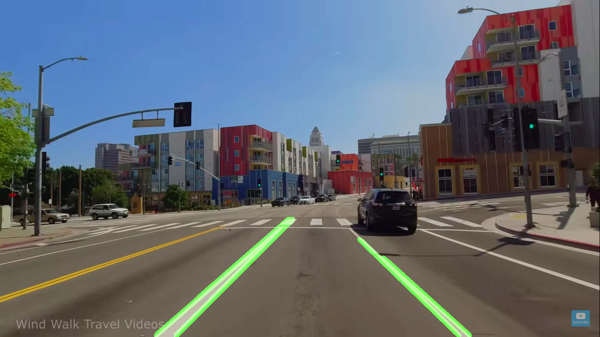
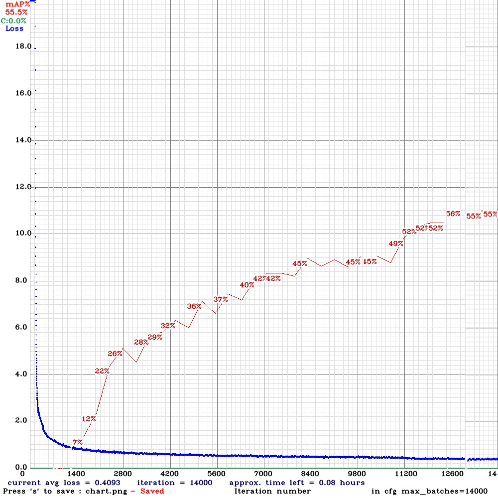

# Real-time Traffic Signs and Lane Detection
## Overview
Detection and tracking of traffic signs, traffic signals and driving lanes using neural networks and computer vision algorithms. [Technical paper link](https://drive.google.com/uc?export=download&id=16MS8Ac8Cc-YZXljWEepQd_YkE77o-CZp)


This repository is divided into 3 sections:
+ **Lane detection:** Contains work related to driving lane detection only.


---

+ **YOLOv4-tiny training:** Contains work related to traffic signs and signals detection and recognition using YOLO.


---

+ **Tensorflow YOLOv4 with lane detection:** Contains final work where the above two things are merged into a single system with Tensorflow framework.


## Installation

+ First clone this repository and nagivate your directory to the cloned repository.

+ Run- 

For Non-GPU:
```sh
$ pip install -r requirements.txt
```


For GPU:
```sh
$ pip install -r requirements-gpu.txt
```


## Setup and run

+ Navigate to [Tensorflow YOLOv4 with lane detection](https://github.com/harshkc03/traffic-signs-signals-and-lane-detection/tree/master/Tensorflow%20YOLOv4%20with%20lane%20detection) directory

+ Run-
```sh
$ python3 detectvideo_lane.py
```
**List of Arguments-**

| Argument        | Description           |
|:------------- |:-------------|
| weights      | path to weights file |
| size      | resize images to      |
| tiny | yolo or yolo-tiny      |
| model | yolov3 or yolov4 |
| video | path to input video |
| iou | iou threshold |
| score | score threshold |
| output | path to output video |
| dis_cv2_window | disable cv2 window during the process |


Example commands with arguments-
```sh
$ python3 detectvideo_lane.py --weights yolov4-tiny-416 --size 416 --tiny --model yolov4 --video test.mp4 --score 0.50 --output out.avi 

$ python3 detectvideo_lane.py --weights yolov4-416 --size 416 --model yolov4 --video test.mp4 --score 0.50 --output out.avi --dis_cv2_window 
```


## References

1. [Yolo v4, v3 and v2 for Windows and Linux](https://github.com/AlexeyAB/darknet)
2. [tensorflow-yolov4-tflite](https://github.com/hunglc007/tensorflow-yolov4-tflite)
